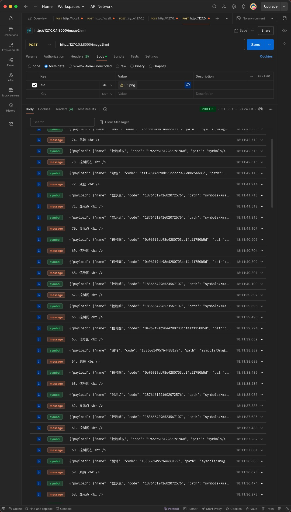

# API 调用说明

## image2hmi

- URL: `/image2hmi`
- METHOD: `POST`
- Headers:
  - `Content-Type`: `multipart/form-data; boundary=<calculated when request is sent>
`
- Body
  - `file` 文件

### 调用示例

> 图片文件在 [images](../images/) 目录中。

#### curl

```shell
curl --location 'http://127.0.0.1:8000/image2hmi' \
--form 'file=@"/Users/guog/Downloads/images/05.png"'
```

#### javascript

```js
const formdata = new FormData();
formdata.append("file", fileInput.files[0], "05.png");

const requestOptions = {
  method: "POST",
  body: formdata,
  redirect: "follow",
};

fetch("http://127.0.0.1:8000/image2hmi", requestOptions)
  .then((response) => response.text())
  .then((result) => console.log(result))
  .catch((error) => console.error(error));
```

### 返回格式

SSE 方式返回，event 有:

- `start` 开始
- `message` 立即显示内容到 UI 界面
- `symbol` 立即绘制图符到图纸
- `done` 完成

其中：`message`、`symbol`会交叉多次, `start`、`done`在开始和结束只一次。

以下为每种 event 响应的原始格式：

#### start

```txt
event: start
data: 开始执行图片分析任务

```

#### done

```txt
event: done
data: 图片分析任务完成

```

#### message

```txt
event: message
data: 66. 控制阀 <br />

```

`data`中会附带`HTML`元素，如上的`<br />`

#### symbol

```txt
event: symbol
data: {"payload": {"name": "控制阀", "code": "1836664296523567107", "path": "symbols/Xmagital图符/扇形阀门4.json"}, "origin": {"name": "控制阀", "confidence": 0.7085452079772949, "x1": 237.21791076660156, "y1": 805.7232666015625, "x2": 268.87060546875, "y2": 832.2986450195312}, "attrs": {"x": 237, "y": 805, "width": 31, "height": 27}, "createdAt": "2025-05-16T18:11:39.695533"}

```

其中`data`值为以下格式化的 JSON 格式内容

```json
{
  "payload": {
    "name": "控制阀",
    "code": "1836664296523567107",
    "path": "symbols/Xmagital图符/扇形阀门4.json"
  },
  "origin": {
    "name": "控制阀",
    "confidence": 0.7085452079772949,
    "x1": 237.21791076660156,
    "y1": 805.7232666015625,
    "x2": 268.87060546875,
    "y2": 832.2986450195312
  },
  "attrs": {
    "x": 237,
    "y": 805,
    "width": 31,
    "height": 27
  },
  "createdAt": "2025-05-16T18:11:39.695533"
}
```

### 调用截图


